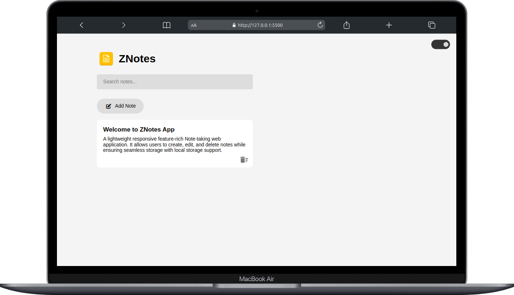

# **ZNotes - Responsive Note-Taking App**

## **📌 Overview**  
ZNotes is a **responsive, feature-rich note-taking web application** built using **HTML, CSS, and JavaScript**. It allows users to create, edit, and delete notes while ensuring seamless storage with **local storage support**. Additionally, the app includes a **Dark/Light Mode toggle**, improving user experience and accessibility.

---
##  Screenshot

## **📂 Features**

### **1️⃣ Add, Edit, and Delete Notes**  
- Users can **create new notes** by clicking the **"Add Notes"** button.  
- Notes are **editable** and can be modified directly within the app.  
- Each note includes a **delete button**, allowing users to remove unwanted notes.  

### **2️⃣ Local Storage Support**
- Notes are **automatically saved in the browser's local storage**, so they persist even after refreshing the page.  
- On reloading the app, previously stored notes are **retrieved and displayed automatically**.

### **3️⃣ Dark & Light Mode Toggle**  
- Users can switch between **Dark Mode and Light Mode ** with a toggle button.  
- The mode selection is **saved in local storage**, ensuring the preferred theme persists across sessions.

### **4️⃣ Fully Responsive UI**  
- The app is **optimized for all screen sizes**, including **desktops, tablets, and mobile devices**.
- **Responsive design ensures smooth usability** across different devices.  

### **5️⃣ Interactive UI with Smooth Animations**  
- The UI is designed with **modern aesthetics**, featuring smooth transitions and animations.  
- The **Dark Mode button is positioned at the top-right corner** for easy accessibility.  

---

## **🛠️ Technologies Used**  

| Technology | Purpose |
|------------|---------|
| **HTML5** | Structure of the app |
| **CSS3** | Styling, layout, and responsiveness |
| **JavaScript (Vanilla JS)** | Functionality, event handling, and local storage |

---

## **📌 How It Works**  

### **1️⃣ User Interaction Flow**  
1. Open the app in a browser.  
2. Click the **"Add Notes"** button to create a new note.  
3. Click inside the note and start typing.  
4. Click the **delete icon** 🗑️ to remove a note.  
5. Click the **Dark Mode button** to toggle between light and dark themes.  

### **2️⃣ Data Persistence**  
- The app stores all notes and theme preferences in **local storage**.  
- When the page reloads, saved notes and the last selected theme are **retrieved and displayed automatically**.  

---

## **🎯 Use Cases**  
✅ Quick note-taking for daily tasks and reminders.  
✅ Jotting down ideas, to-dos, or work-related notes.  
✅ A lightweight, distraction-free alternative to full-fledged note apps.  

---

## **🚀 Deployment & Future Improvements**  
📌 The project **hosted on Netlify**

---

## **🔗 GitHub Repository & Live Demo**  
- **GitHub Repo:** https://github.com/codewithdhruba01/Znote 
- **Live Demo:** https://znotes-app.netlify.app/

---
